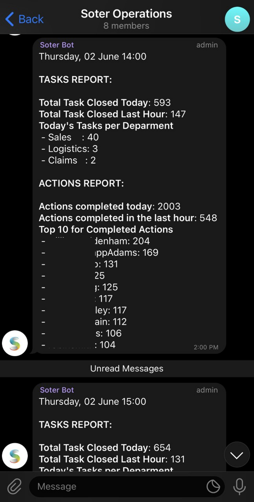
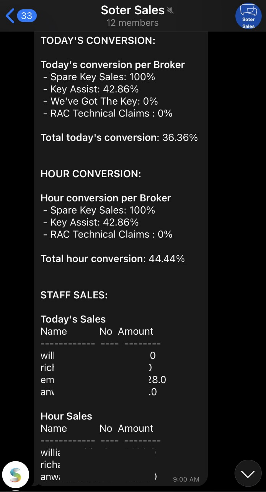

# Report Telegram Bot Project

This project is in charge of sending real live queries in form of a text message through Telegram API to report the daily figures of the different business areas.

## .env File

The environment variables file must be in the main folder of the project with the following name "**.env**" and contain the following variables:

* API_KEY = Unique identifier and secret token for authentication purposes in Telegram API
* SERVER = Databse server
* DATABASE = Database 'database'
* USER_NAME = Database user name
* PASSWORD = Database password
* MAIN_PATH = Project main path
* TEST_GROUP = Chat id of the TEST group
* OPERATIONS_GROUP = Chat id of the OPERATIONS group
* SALES_GROUP = Chat id of the SALES group
* LOCKSMITHS_GROUP = Chat id of the LOCKSMITH group

To get the chats ids you must use this link, after adding the bot as admin to the new group look inside the response JSON for the necessary chat id.
```
https://api.telegram.org/bot<API_KEY>/getUpdates
```

## ./SRC code

This project uses a few custom modules to address different goals. These modules are shared between the different chat reports.

### ./SRC/bot.py

This is a custom module to be imported from other code. Its function is to send messages and images to a chat id.
To get the chat id, it should be search using the above URL.

### ./SRC/db.py

This is a custom module to get a DataFrame based on a SQL query.

### ./SRC/utils_bot.py

This is a curtom module to adapt the format of the data (queries results) to be printed on Telegram.

# Operations report



In the image above you can see what the chat and report look like within Telegram.

## operations.py

This is the main python script to generate the report for the group of operations.
This code makes use of a series of queries saved inside the '**./queries/operations/**' path, all these queries are '**.txt**' files and can be modified as needed.

## operations.bat

This is a windows executable file and it serves two purposes. Can be run with a click or used within a task within the windows scheduler. This code outputs a
'**.log**' file reporting the execution results
The file is excecuted every hour.

## ./logs/operations_batch.log

Log file execution report of operations.bat

## Use:
Python:

It can be used like this:
```
python operations.py
```
Windows executable:

Just look the 'operations.bat' in your files and click it, or used within a task
within the windows scheduler.

# Sales report



In the image above you can see what the chat and report look like within Telegram.

## sales.py
This is the main python script to generate the sales report for the group of sales.
The code uses a serie of queries saved inside the '**./queries/sales/**' path, all these queries are '**.txt**' files and can be modified as needed.

## sales.bat

This is a windows executable file and it serves two purposes. Can be run with a click or used within a task within the windows scheduler. This code outputs a
'**.log**' file reporting the execution results
For the bot purpose, the file is executed inside a Window sheduler every hour of the day.

## ./logs/sales_batch.log

Log file execution report of sales.bat

## Use:
Python:

It can be used like this:
```
python sales.py
```
Windows executable:

Just look the 'sales.bat' in your files and click it, or used within a task inside the windows scheduler.

# Locksmith report


In the image above you can see what the chat and report look like within Telegram.

## locksmiths.py

This is the main python script to generate the report for the group of locksmith.
This code makes use of a series of queries saved inside the '**./queries/locksmiths/**' path, all these queries are '**.txt**' files and can be modified as needed. 